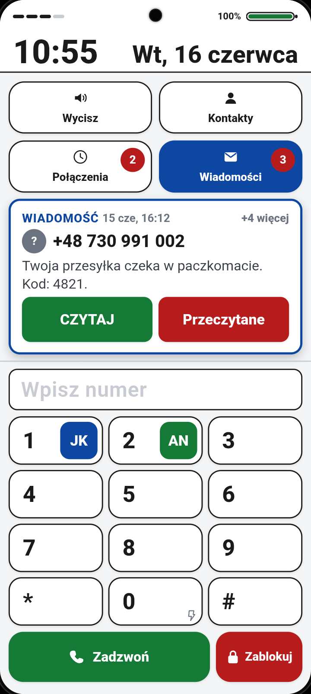
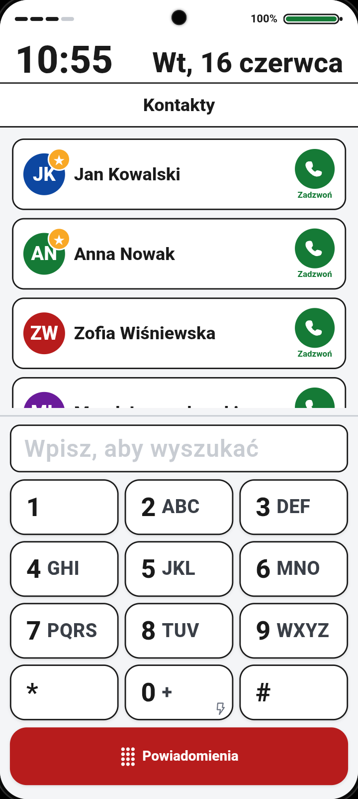
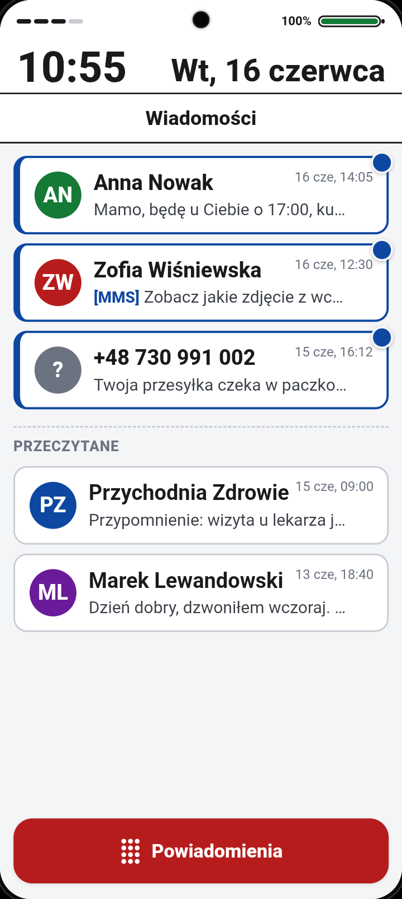
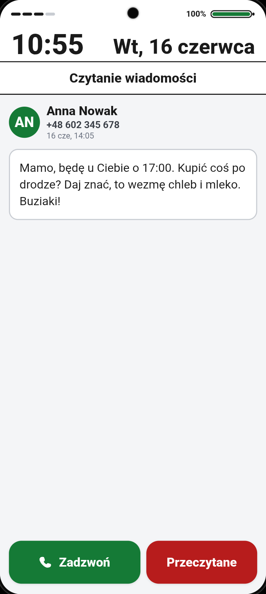
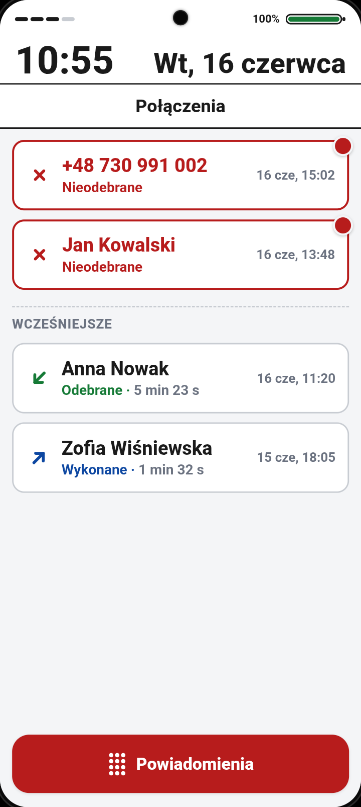
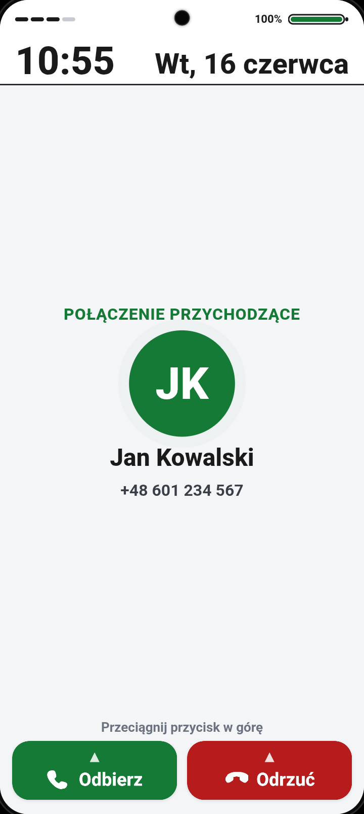
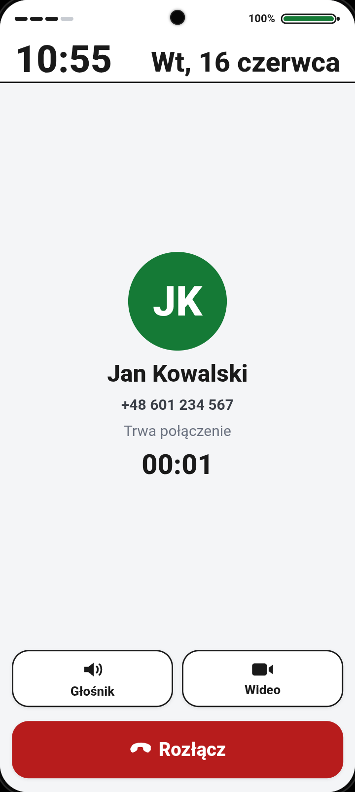
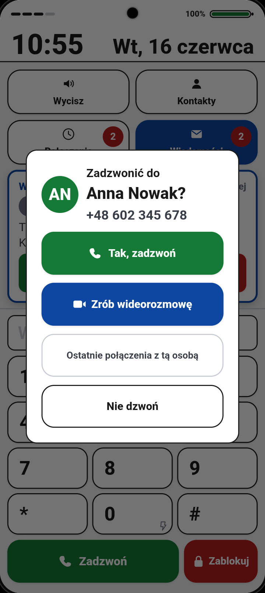
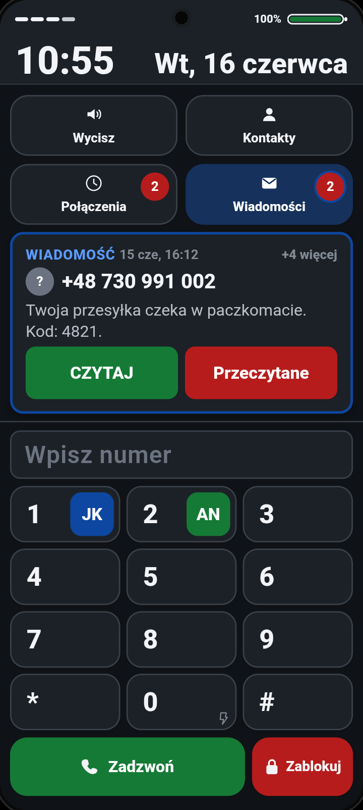

# Telefon Seniora — mockup launchera (PWA)

> **▶️ Wersja na żywo:** **https://look997.github.io/senior-mockup/**
> Otwórz na telefonie i dodaj do ekranu głównego, by uruchomić na pełnym ekranie.

Makieta prostego launchera dla osoby starszej, działająca jako **aplikacja webowa (PWA)** na pełnym ekranie telefonu. Zbiera inspiracje (BIG Launcher, Doro, Jitterbug, Samsung Easy Mode, Key/T9 Launcher) w jeden spójny, „wysepkowy" projekt. Styl: jasna baza, wysoki kontrast, taktylne „fizyczne klawisze", kolorowe akcenty funkcyjne (zielony = zadzwoń, czerwony = nieodebrane/usuń, niebieski = wiadomości). Obsługa wyłącznie przez dotknięcia dużych przycisków; kilka funkcji przez dłuższe przytrzymanie, a połączenie przychodzące i blokadę — przez przeciągnięcie.

Czysty **vanilla HTML/CSS/JS**, bez frameworków i zależności.

## Wymiary i środowisko

- Bazowy ekran **720×1604 px** (proporcje Motorola Moto E15). Ramka jest **wyśrodkowana** na czarnym tle z zaokrąglonymi rogami i **symulowanym oczkiem aparatu** (punch-hole).
- Skalowanie ramki liczy JS (`fitFrame()` → `--scale`), więc działa na dowolnym ekranie.
- **Testowane na:** Samsung Galaxy S24 FE (1080×2340), Chrome na Androidzie, uruchamiane jako PWA w trybie `fullscreen`.

## Galeria

| Ekran główny | Kontakty | Wiadomości |
|:---:|:---:|:---:|
|  |  |  |
| **Czytanie wiadomości** | **Połączenia** | **Połączenie przychodzące** |
|  |  |  |
| **Rozmowa** | **Potwierdzenie dzwonienia** | **Tryb ciemny** |
|  |  |  |

## Uruchomienie

### Online (najprościej)

Otwórz **https://look997.github.io/senior-mockup/** w przeglądarce telefonu. W Chrome: **menu (⋮) → „Dodaj do ekranu głównego"** — uruchomiona z ikony aplikacja startuje w trybie `fullscreen` (bez paska adresu i systemowego paska statusu — rysujemy własny).

### Lokalnie / na telefonie przez `adb`

Wymagane: Node 20+, `adb`, telefon podłączony (USB lub WiFi `adb connect IP:5555`).

```bash
# 1. Uruchom serwer (port 8080)
node serve.js

# 2. W drugim terminalu: tunel + otwórz Chrome na telefonie
./deploy.sh
# (dla konkretnego urządzenia: DEVICE=192.168.1.42:5555 ./deploy.sh)
```

`deploy.sh` robi `adb reverse tcp:8080 tcp:8080` i otwiera `http://localhost:8080` w Chrome na telefonie. `localhost` jest traktowany jako bezpieczny kontekst, więc PWA i service worker działają bez HTTPS.

Regeneracja ikon PWA: `node gen-icons.js`.

---

# Dokumentacja

Makieta prostego launchera dla osoby starszej, działająca jako aplikacja webowa (PWA) na pełnym ekranie telefonu. Sztywna ramka 720×1604 px, wyśrodkowana na czarnym tle, z symulowanym oczkiem aparatu. Obsługa wyłącznie przez dotknięcia dużych przycisków, kilka funkcji przez dłuższe przytrzymanie, a połączenie przychodzące i blokadę przez przeciągnięcie. Brak klasycznych gestów poza przewijaniem długich list.

## Spis widoków

- Ekran powiadomień (główny: klawiatura + kafle)
- Kontakty
- Wiadomości (skrzynka)
- Czytanie wiadomości
- Połączenia
- Ostatnie połączenia z kontaktem
- Potwierdzenie połączenia
- Rozmowa (aktywne połączenie)
- Wideorozmowa
- Połączenie przychodzące
- Blokada ekranu

---

## Elementy wspólne (obecne na wielu widokach, nie są widokami)

### Pasek statusu
Stały, na górze każdego widoku.
- Wskaźnik zasięgu (lewa strona oczka) i pasek baterii z procentem (prawa strona oczka).
- Pomarańczowa kropka tuż na prawo od oczka — ogólne powiadomienie systemowe (nie wiadomość, nie połączenie).
- Duży zegar (lewo) i duża data w skróconym formacie, np. „Wt, 16 czerwca" (prawo).
- Bateria czerwienieje poniżej 20%.

### Powiadomienia
Panel pojawiający się nad klawiaturą na ekranie głównym.
- Pokazuje najnowsze powiadomienie na wierzchu; licznik „+N więcej" gdy czeka więcej.
- Wiadomość: nadawca, godzina, zajawka, przyciski **CZYTAJ** / **Przeczytane**.
- Nieodebrane połączenie: nazwa, numer, godzina, przyciski **ODDZWOŃ** / **Odrzuć**.
- Powiadomienia nie znikają same — dopiero reakcja pokazuje następne (przeglądanie po kolei).
- Współgra z podpowiedzią dopasowania numeru (opis w decyzjach projektowych).

### Popup potwierdzenia dzwonienia
Okno nakładkowe na przyciemnionym tle, przed każdym połączeniem.
- Duża nazwa i duży numer rozmówcy.
- Przyciski: zielony **Tak, zadzwoń**, niebieski **Zrób wideorozmowę**, **Ostatnie połączenia z tą osobą** (zawsze dostępne — pusta historia pokaże komunikat; delikatny styl), **Nie dzwoń**.
- Zamykają je tylko przyciski (nie kliknięcie w tło). „Nie dzwoń" oznacza nieodebrane jako obejrzane.

---

## Co zawiera każdy widok

### Ekran powiadomień (główny)
- Cztery kafle 2×2: **Wycisz**, **Kontakty**, **Połączenia**, **Wiadomości**.
- Kafle Połączenia i Wiadomości mają w rogu czerwony znacznik z liczbą nowych zdarzeń.
- Panel powiadomień nad klawiaturą (element wspólny, opis wyżej).
- Pole „Wpisz numer" z formatowaniem (kierunkowy +48 osobno, reszta po 3 cyfry).
- Klawiatura: cyfra do lewej, litery obok. Na klawiszu 0 mała ikona latarki.
- Na klawiszach 1, 2, 3… widać **awatary ulubionych kontaktów** (po kolei z listy ulubionych).
- Przycisk **Zadzwoń** (zielony) i czerwony przycisk dwustanowy: **Zablokuj** (pole puste) / **Usuń** (po wpisaniu).

### Kontakty
- Tytuł „Kontakty" (bez przycisku cofania).
- Lista kontaktów; **ulubione na górze z gwiazdką w rogu awatara** (bez nagłówków sekcji).
- Każda karta: awatar, nazwa, zielony przycisk **Zadzwoń**.
- Pod listą klawiatura-filtr (multi-tap T9): wpisywanie liter filtruje listę.
- W nazwach na liście **pasujące litery są wyróżnione innym odcieniem** (zielony akcent, bez pogrubienia) — widać, która część nazwy odpowiada wpisanemu ciągowi.
- Jeden czerwony przycisk: **Powiadomienia** (pole puste, wraca na główny) / **Usuń** (po wpisaniu).

### Wiadomości (skrzynka)
- Tytuł „Wiadomości" (bez cofania).
- Lista kart: nadawca, podgląd, data i godzina (np. „16 cze, 14:05").
- **Nieprzeczytane na górze** (niebieski obrys + znacznik), pod nimi etykieta „Przeczytane" i reszta.
- MMS oznaczony etykietą „[MMS]" (niebieska gdy nieprzeczytane, szara po przeczytaniu).
- Czerwony przycisk **Powiadomienia** na dole.

### Czytanie wiadomości
- Awatar, nazwa nadawcy, jego numer, data i godzina.
- Dla MMS — kafelek ze zdjęciem.
- Pełna treść dużą czcionką.
- Przyciski: zielony **Zadzwoń** do nadawcy, czerwony **Przeczytane**.

### Połączenia
- Tytuł „Połączenia" (bez cofania).
- Lista: ikona kierunku, nazwa, opis i — w jednym rzędzie — czas trwania, np. „Odebrane · 5 min 23 s"; po prawej data i godzina.
- Kodowanie potrójne: kolor, kształt strzałki, słowo (nieodebrane czerwone, odebrane zielone, wykonane niebieskie).
- **Nieobejrzane nieodebrane na górze**, pod nimi etykieta „Wcześniejsze" i reszta.
- Czerwony przycisk **Powiadomienia** na dole.

### Ostatnie połączenia z kontaktem
- Historia połączeń z jedną osobą, w stylu listy połączeń, z dokładnymi datami i czasem trwania.
- Łączy świeże połączenia (z bieżącej sesji, w tym symulowane) z wcześniejszą historią; najnowsze na górze.
- Dla osoby/numeru bez żadnych połączeń pokazuje „Brak wcześniejszych połączeń".
- Dolny przycisk wraca do źródła: **Kontakty**, **Połączenia** albo **Wiadomość** (zależnie skąd otwarto).

### Potwierdzenie połączenia
- Widok-nakładka opisany w „Elementy wspólne → Popup potwierdzenia dzwonienia".

### Rozmowa (aktywne połączenie)
- Awatar, nazwa i numer rozmówcy, status, licznik czasu.
- Przełączniki: **Głośnik**, **Wideo**.
- Duży czerwony **Rozłącz**.

### Wideorozmowa
- Obszar obrazu rozmówcy (placeholder), mały podgląd „Ty", numer i licznik czasu.
- Przyciski: **Tylko głos**, **Rozłącz**.

### Połączenie przychodzące
- Nagłówek „Połączenie przychodzące" lub „Wideorozmowa przychodząca".
- Pulsujący awatar, nazwa, numer, dzwonek w tle.
- Przeciągane w górę: **Odbierz** (ikona kamery przy wideorozmowie), **Odbierz tylko głosowo** (przy wideorozmowie), **Odrzuć**.

### Blokada ekranu
- Kłódka, animowana strzałka, napis „Przeciągnij w górę, aby odblokować".
- Godzina i data tylko na pasku statusu.
- W trybie ciemnym tło ekranu i paska statusu są tym samym ciemnym kolorem (bez szwu).

---

## Decyzje projektowe (jak i dlaczego coś działa)

### Powiadomienia jako kolejka do przeglądania
- W danym momencie widać jedno powiadomienie; nie znika samo, dopiero reakcja pokazuje następne.
- Wejście w wiadomość przez „CZYTAJ" i naciśnięcie „Przeczytane" w pełnym widoku wraca **do następnego powiadomienia**, nie do listy.

### Podpowiedź dopasowania numeru a powiadomienia
- Gdy wpisujesz numer pasujący do jednego kontaktu, w obszarze powiadomień pojawia się „Dopasowano do wpisywanego numeru" — **zamiast** powiadomień. W pokazanym numerze **cyfry zgodne z tym, co wpisałeś, są wyróżnione innym odcieniem** (zielony akcent, bez pogrubienia).
- Jeśli wtedy przyjdzie nowa wiadomość/połączenie, to ono (świeższe, priorytetowe) pokazuje się **nad** dopasowaniem.
- Po odhaczeniu świeżych powiadomień, gdy numer dalej wpisany, znów widać dopasowanie — płynny powrót.

### Wyróżnianie pasujących znaków przy wyszukiwaniu
- Podczas wyszukiwania wyróżniamy **dokładnie tę część**, która odpowiada wpisanemu ciągowi: litery w nazwach kontaktów (filtr) i cyfry w podpowiedzi dopasowania numeru.
- Wyróżnienie to **inny odcień** (zielony akcent z delikatnym tłem), **bez pogrubiania** — ma podpowiadać, a nie krzyczeć; reszta tekstu zostaje tak samo czytelna.
- Dopasowanie liter ignoruje wielkość znaków i polskie znaki diakrytyczne (np. wpisane „sni" podświetli „śni"). Dla numeru wyróżnienie poprawnie przeskakuje spacje i kierunkowy w sformatowanym zapisie.
- W trybie ciemnym akcent jest rozjaśniony, by zachować kontrast na ciemnym tle.

### Identyczny dialer i jednolite przyciski
- Klawiatura na ekranie głównym i w Kontaktach to ten sam komponent o tej samej szerokości i pozycji.
- Wszystkie dolne przyciski akcji mają **jedną wysokość** na wszystkich ekranach i kończą się na tej samej wysokości.
- Przyciski są płaskie (bez efektu 3D), z miękko zaokrąglonymi rogami.

### Numery i kontakty
- Numery wszędzie formatowane jednolicie (kierunkowy osobno, cyfry po 3).
- Wpisany numer pasujący do kontaktu pokazuje jego nazwę.
- Wiadomości i połączenia od numerów spoza kontaktów pokazują sam numer i szary awatar.

### Połączenia
- Połączenie wymaga potwierdzenia. Może pojawić się informacja o nawiązywaniu połączenia przed jego zestawieniem.
- Odbierane połączenie łączy się od razu.
- Odebranie wideorozmowy daje wybór: wideo albo tylko głos.

### Tryb ciemny i dostępność
- Pełny motyw ciemny: ciemne tła i karty, jasny tekst, rozjaśnione kolory funkcyjne, ciemniejszy niebieski kafel Wiadomości z białą ikoną, zmiękczone obrysy.
- Duże cele dotykowe, wysoki kontrast, brak gestów poza przeciąganiem tam, gdzie naśladuje telefon (odbieranie, odblokowanie).

### Dźwięki i wibracje
- Krótka wibracja przy dotknięciach (o ile nie wyciszono).
- Dźwięk nowej wiadomości i dzwonek połączenia generowane programowo; dzwonek milknie po odebraniu, odrzuceniu lub opuszczeniu ekranu połączenia przychodzącego.

### Świadome ograniczenia zakresu (czego celowo nie ma i dlaczego)
Nakładka ma być maksymalnie prosta dla seniora i **nie wypuszczać go poza siebie**. Dlatego świadomie pominięto:
- **Pisanie i wysyłanie wiadomości** — wiadomości są tylko do odczytu; jedyna odpowiedź to oddzwonienie. Brak klawiatury tekstowej i ekranu redagowania.
- **Usuwanie wiadomości** — nie ma kasowania ze skrzynki; wiadomości tylko się czyta i oznacza jako przeczytane (mniej akcji do pomylenia, brak ryzyka utraty czegoś ważnego).
- **Osobny kalendarz i alarmy** — brak aplikacji kalendarza, budzika czy przypomnień. Tego rodzaju funkcje są poza zakresem prostego launchera.
- **Osobne ustawienia** — nie ma ekranu ustawień. Nieliczne przełączniki (tryb ciemny, wyciszenie, latarka) są dostępne przez przytrzymanie odpowiednich elementów, bez menu konfiguracji.
- **Jakiekolwiek inne aplikacje w nakładce** — nakładka nie jest pełnym launcherem z siatką aplikacji; nie da się z niej uruchomić żadnego innego programu. Są tylko: telefon, kontakty, wiadomości, połączenia.
- **Działające linki i wyjścia poza nakładkę** — **linki w treści wiadomości celowo nie działają**, żeby kliknięcie nie otworzyło przeglądarki i nie wyrwało użytkownika z nakładki. Tak samo blokowana jest każda inna droga ucieczki — gest, długie przytrzymanie tekstu, menu kontekstowe. Jedyne wyjście to ukryte „sekretne wrota" (opisane w funkcjach), wymagające celowej, trudnej do przypadkowego wykonania sekwencji.
- **Tapeta** — brak tła/tapety, bo nie ma gdzie jej pokazać: każdy ekran jest w całości wypełniony treścią (kafle, listy, klawiatura), również **ekran blokady** nie ma tapety.
- **Awatary na listach połączeń** — w „Połączeniach" i w „Ostatnich połączeniach z tą osobą" **nie ma awatarów**; ich miejsce zajmuje ikona rodzaju połączenia (odebrane / wykonane / nieodebrane), która niesie ważniejszą informację. Awatary są tam, gdzie identyfikują osobę (Kontakty, Wiadomości, ekrany rozmowy).

---

## Funkcje (prawdziwe, działają same w sobie)

Te funkcje działają realnie w makiecie (część efektu fizycznego — jak zapalenie diody latarki czy wyjście do systemu — leży poza możliwościami aplikacji webowej; wzmianki o tym w sekcji symulacji).

- **Latarka** — przytrzymaj klawisz **0** na klawiaturze. Włącza/wyłącza; ikona latarki na klawiszu się podświetla.
- **Wyciszenie / odciszenie** — przytrzymaj kafel **Wycisz** (napis zmienia się na „Odcisz"); blokuje wibracje i dźwięki.
- **Tryb ciemny** — przytrzymaj strefę **zasięgu** (lewa strona oczka). Przełącza jasny/ciemny motyw.
- **Zablokowanie ekranu** — przytrzymaj czerwony przycisk **Zablokuj** przy pustym polu numeru.
- **Odblokowanie** — **przeciągnij** ekran blokady w górę (kłódka jedzie za palcem); odpowiednik czytnika odcisku.
- **Szybkie wybieranie ulubionych** — przytrzymaj klawisz **1, 2, 3…**, dzwoni kolejno do ulubionych z listy.
- **Sekretne wrota do natywnego ekranu telefonu** — przytrzymaj strefę baterii (bzyk), a potem w kilka sekund strefę zasięgu (bzyk).

---

## Symulacje zdarzeń (sztuczne wywołanie tego, co normalnie przychodzi z zewnątrz)

Tu chodzi wyłącznie o ręczne wywołanie zdarzeń, których w makiecie nikt z zewnątrz nie wyśle.

- **Połączenie przychodzące — głosowe** (Połączenie przychodzące) — przytrzymaj przycisk **Zadzwoń** na ekranie głównym.
- **Połączenie przychodzące — wideo** (Połączenie przychodzące → Wideorozmowa) — przytrzymaj kafel **Kontakty**.
- **Nowa wiadomość** (Wiadomości, Powiadomienia) — przytrzymaj kafel **Wiadomości**. Dodaje nowy wpis na górę skrzynki, pokazuje powiadomienie i gra dźwięk.
- **Nowe nieodebrane połączenie** (Połączenia, Powiadomienia) — przytrzymaj kafel **Połączenia**. Dodaje nowe nieodebrane na górę listy i powiadomienie.
- **Pomarańczowa kropka powiadomień ogólnych** (Pasek statusu) — przytrzymaj strefę **baterii** (prawa strona oczka); ponowne przytrzymanie ją gasi.

Szczegóły symulacji:
- **Zakończone rozmowy trafiają na listę „Połączenia"** — każda rozmowa dopisuje się do historii po zakończeniu: wychodząca jako „Wykonane" (z czasem trwania), odebrana przychodząca jako „Odebrane", a odrzucona przychodząca jako „Nieodebrane". Pojawiają się też w „Ostatnich połączeniach z tą osobą".
- **Powiadomienia startowe** — po uruchomieniu w kolejce powiadomień są już domyślne nieprzeczytane wiadomości i nieodebrane połączenia (znaczniki z liczbą na kaflach pokazują ich liczbę). Stanowią punkt wyjścia do przeglądania.
- **Faza nawiązywania ~2 s** — przy połączeniu wychodzącym przez około dwie sekundy widać status „Nawiązywanie połączenia…", po czym status zmienia się na „Trwa połączenie" i rusza licznik. To symulacja czasu zestawiania.
- **Ograniczenia środowiska** — efekty fizyczne prawdziwych funkcji nie zachodzą w aplikacji webowej: latarka nie zapala realnie diody, wyciszenie nie ucisza systemowego dzwonka, sekretne wrota nie przenoszą faktycznie do natywnego launchera, a obraz wideorozmowy jest placeholderem. Same funkcje są jednak prawdziwe i ich logika działa.

---

## Struktura plików

| Plik | Rola |
|------|------|
| `index.html` | struktura ekranów + inline SVG ikony |
| `styles.css` | wysepkowy taktylny styl, ramka, pasek statusu, tryb ciemny |
| `app.js` | skalowanie ramki, zegar/data/bateria, nawigacja, dialery, render danych, połączenia, powiadomienia |
| `manifest.json` | PWA (display: fullscreen, ikony) |
| `sw.js` | service worker (network-first + offline fallback) |
| `gen-icons.js` | generuje ikony PNG bez zależności |
| `serve.js` | serwer statyczny (no-cache, Service-Worker-Allowed) |
| `deploy.sh` | adb reverse + otwarcie Chrome na telefonie |
| `FUNKCJE.md` | pełna dokumentacja funkcji (źródło sekcji powyżej) |
